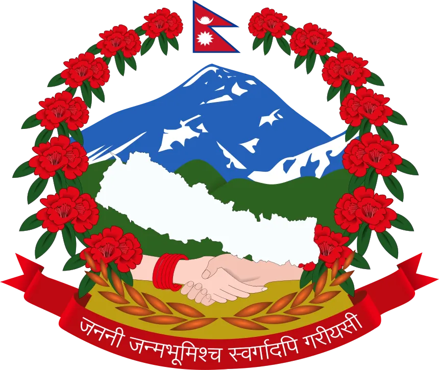

<!-- PROJECT LOGO --> <br /> <p align="center"> <a href="https://github.com/Suyog-16/nepal-legal-chatbot">  </a> <h3 align="center">NyaySathi</h3> <p align="center"> A Retrieval-Augmented Generation (RAG) Based Legal Chatbot for Nepali Laws and Constitution <br /> <i>“Empowering citizens with accessible legal knowledge.”</i> <br /><br /> <!-- <a href="#usage">View Demo</a> --> </p> </p> <!-- ABOUT THE PROJECT -->
# About The Project

NyaySathi is a legal chatbot for Nepal that helps users understand and explore the Constitution, Acts, Policies, and Regulations of the country in simple English.  
It uses Retrieval-Augmented Generation (RAG) to fetch accurate and up-to-date legal information from trusted government sources and responds with clear explanations along with citations from official legal documents.

The project aims to make Nepalese law accessible, understandable, and searchable for:  
- Citizens seeking legal awareness  
- Law students exploring legal frameworks  
- Professionals looking for quick legal references  

NyaySathi bridges the gap between citizens and complex legal texts — one query at a time.

## Key Legal Documents

NyaySathi is based on these important Nepalese legal codes and acts:  
- Constitution of Nepal  
- Environment Protection Act  
- Foreign Investment and Technology Transfer Act,2019  
- Industrial Enterprises Act,2020  
- National Civil Code,2017(2074)
- National Criminal Procedure Code,2017(2074) 
- National Human Rights Commission Act  
- National Penal Code,2017(2074)  
- Prevention of Corruption Act,2002  
- The Labour Act 2017  

## Installation

### Clone the Repository  
```bash
git clone https://github.com/Suyog-16/nepal-legal-chatbot.git  
cd nepal-legal-chatbot  
```  

### Install Dependencies  
```bash
pip install -r requirements.txt  
```  

### Run the Application  
```bash
streamlit run app/streamlit.py  
```  

## Usage

You can ask NyaySathi questions such as:  

**In the Nepalese Banking Offences Act, what constitutes insider trading and its punishments?**  
Or,  
**What penalties does the Nepalese Penal Code impose for cybercrimes involving unauthorized data access?**  

It responds with a clear, concise explanation citing relevant articles or sections from the Constitution of Nepal or related acts.

## License

Distributed under the MIT License.  
See LICENSE for more information.

## Authors

Suyog Ghimire  
Email: ghimiresuyog89@gmail.com  

Project Link: https://github.com/Suyog-16/nepal-legal-chatbot  

## Thank You

If you find this project useful, consider giving it a star on GitHub to support its development.